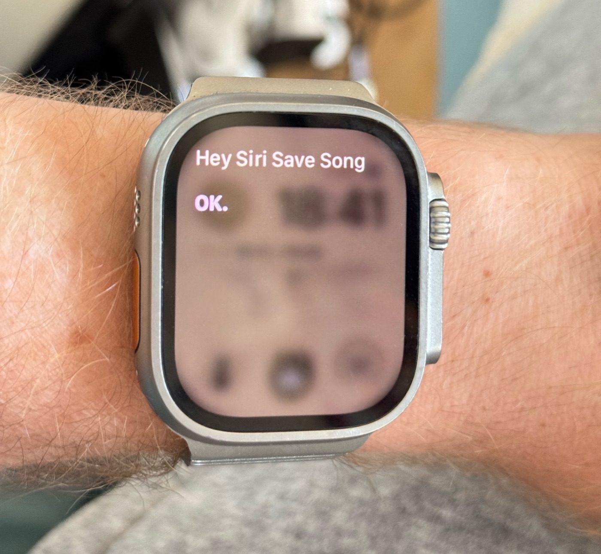

# Save Song 🎵

Save the Spotify track you're currently listening to, with one tap on your iPhone.

An iPhone **Shortcut** calls a tiny **Cloudflare Worker**, which talks to the **Spotify Web API**: it checks what's playing right now and adds it to your library. You get a notification with the song title back on your phone.

```
iPhone Shortcut ──▶ Cloudflare Worker ──▶ Spotify Web API
   (one tap)         (auth + logic)        (save track)
```

## In action

Works hands-free with Siri, including from an Apple Watch, so your phone can stay in your pocket:



Say **"Hey Siri, Save Song"** and Siri runs the Shortcut: the Worker saves the currently playing track, and the song title flashes up on your watch.

Why a Worker in the middle? Spotify's API needs OAuth tokens that expire and have to be refreshed. The Worker keeps your Spotify credentials safe as server-side secrets and handles the token refresh, so the Shortcut itself stays dumb and simple: it only knows one URL and one app token.

## Get the Shortcut

**Option A: download the ready-made Shortcut**

> ⬇️ [Download **Save Song.shortcut**](https://github.com/Boykot79/spotify-save-song/raw/main/Save%20Song.shortcut)

Open the downloaded file on your iPhone (or Mac) and Shortcuts will offer to add it. Then edit the Shortcut and replace the two placeholders in the "Get Contents of URL" action: the URL (`https://YOUR-WORKER.workers.dev`) and the `X-App-Token` header value (`YOUR-APP-TOKEN`). You'll get both from [Setup](#setup) below.

**Option B: build it yourself** (3 actions):

1. **Get Contents of URL**
   - URL: `https://spotify-saver.<your-subdomain>.workers.dev`
   - Method: `GET`
   - Headers: `X-App-Token` → *your APP_TOKEN (see below)*
2. **Get Dictionary Value** with key `title` (add another for `artist` if you like)
3. **Show Notification**, e.g. `Saved: [title]`

Add it to your Home Screen, the Action Button, or the Lock Screen for true one-tap saving.

## Setup

### 1. Create a Spotify app

1. Go to the [Spotify Developer Dashboard](https://developer.spotify.com/dashboard) and create an app.
2. Note the **Client ID** and **Client Secret**.
3. Add a Redirect URI, e.g. `http://127.0.0.1:8888/callback`.

### 2. Get a refresh token

Authorize your own account once, with the two scopes this Worker needs:

1. Open this URL in a browser (fill in your Client ID):

   ```
   https://accounts.spotify.com/authorize?client_id=YOUR_CLIENT_ID&response_type=code&redirect_uri=http://127.0.0.1:8888/callback&scope=user-read-currently-playing%20user-library-modify
   ```

2. After you approve, you'll land on a `127.0.0.1:8888/callback?code=...` URL that won't load. That's fine, just copy the `code` from the address bar.

3. Exchange the code for a refresh token (fill in your values):

   ```bash
   curl -s -X POST https://accounts.spotify.com/api/token \
     -H "Content-Type: application/x-www-form-urlencoded" \
     -u "YOUR_CLIENT_ID:YOUR_CLIENT_SECRET" \
     -d "grant_type=authorization_code&code=YOUR_CODE&redirect_uri=http://127.0.0.1:8888/callback"
   ```

   Save the `refresh_token` from the response.

### 3. Deploy the Worker

```bash
git clone https://github.com/Boykot79/spotify-save-song.git
cd spotify-save-song
npm install
npx wrangler deploy
```

Then set the four secrets (each command prompts you for the value):

```bash
npx wrangler secret put SPOTIFY_CLIENT_ID
npx wrangler secret put SPOTIFY_CLIENT_SECRET
npx wrangler secret put SPOTIFY_REFRESH_TOKEN
npx wrangler secret put APP_TOKEN
```

`APP_TOKEN` is a password you invent yourself. It's what stops strangers from poking your Worker. Generate a good one with:

```bash
openssl rand -hex 16
```

### 4. Connect the Shortcut

Put your Worker URL and your `APP_TOKEN` into the Shortcut (see [Get the Shortcut](#get-the-shortcut)) and you're done.

## API

`GET /` with header `X-App-Token: <your token>`

| Response | Meaning |
|---|---|
| `{ "saved": true, "title": "...", "artist": "..." }` | Track saved to your library |
| `{ "error": "nothing_playing" }` | Nothing is playing right now |
| `{ "error": "not_a_track" }` | A podcast is playing, not a song |
| `{ "error": "unauthorized" }` | Wrong or missing `X-App-Token` |

## Security notes

- All credentials live as [Worker secrets](https://developers.cloudflare.com/workers/configuration/secrets/). Nothing sensitive is in this repo, and nothing sensitive should ever be committed to your fork either.
- If you share your own copy of the Shortcut, **remove your Worker URL and APP_TOKEN first**. Anyone with those two values can save songs to *your* library.

## License

[MIT](LICENSE)
